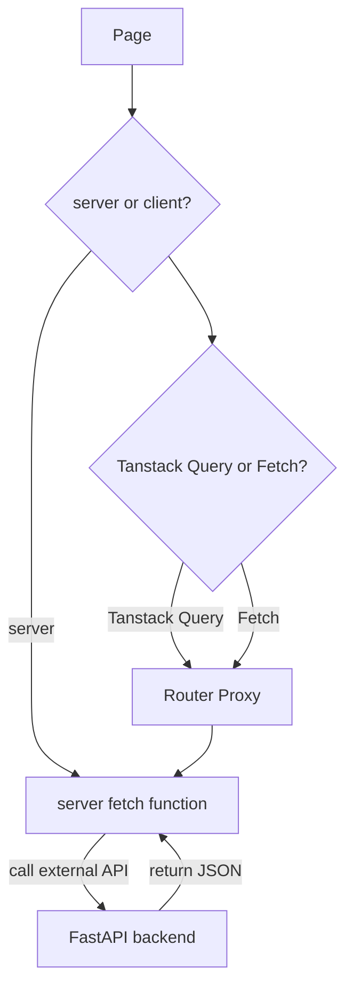

# TCF Warehouse FrontEnd

## Coding Conventions

### 1. Styling

1. JSX - `kebab-case`
2. TS - `camelCase`
3. classes, functions, components - `PascalCase`

### 2. Schema First

1. Props should always inherit or reuse Zod BasicObjectSchema

### 3. Architecture

Flow: Component -> Action -> External API call to FastAPI backend

## Call API from Client with Auth (User search is implemented this way)

1. Create a router and call the external API from the server
2. Call the router from the client with Tanstack Query for caching and data fetching'

## Tanstack Query

1. Install with pnpm `pnpm add @tanstack/react-query`
2. Create QueryProvider

```tsx
"use client";

import { QueryClient, QueryClientProvider } from "@tanstack/react-query";
import { ReactNode, useState } from "react";

export function QueryProvider({ children }: { children: ReactNode }) {
  const [client] = useState(() => new QueryClient());

  return <QueryClientProvider client={client}>{children}</QueryClientProvider>;
}
```

Use it in RootLayout as following:

```tsx
<body className={`${inter.className} antialiased`}>
  <QueryProvider>{children}</QueryProvider>
</body>
```

## next-intl or i18n

docs next-intl: [link](https://next-intl.dev/docs/getting-started/app-router/without-i18n-routing) &
demo source code: [link](https://github.com/amannn/next-intl/tree/main/examples/example-app-router-without-i18n-routing)

```
├── messages
│   ├── en.json
│   └── ...
├── next.config.ts
└── src
    ├── i18n
    │   ├── request.ts
    │   └── config.ts
    ├── services
    │   └── locale.ts
    └── app
        ├── layout.tsx
        └── page.tsx
```

## Data Fetching Strategy



## Data Mutation Strategy


